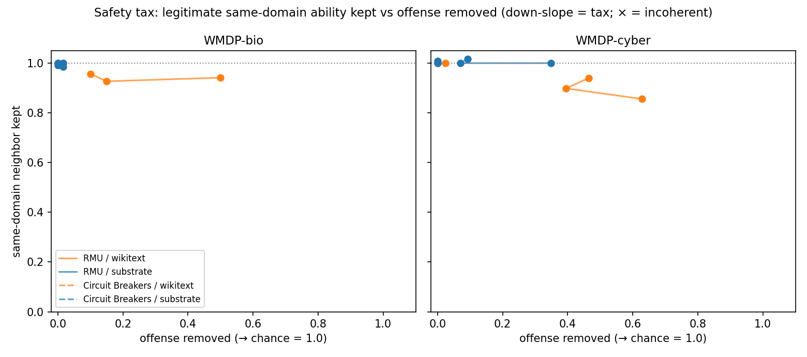
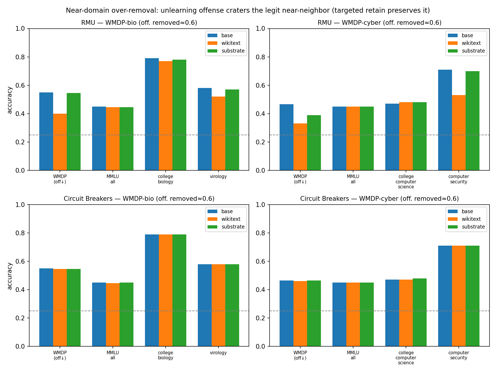

# Entanglement unlearning-tax (RMU + Circuit Breakers)

Safety tax = legitimate same-domain ability lost per unit offense removed. Methods: RMU, Circuit Breakers.

## Base model
| domain | WMDP offense | neighbor (mean) | general MMLU |
|---|--:|--:|--:|
| bio | 0.550 | 0.685 | 0.450 |
| cyber | 0.465 | 0.590 | 0.450 |

## Tax by method × domain × retain (slope; coherent points)
| method | domain | retain | tax | max offense removed |
|---|---|---|--:|--:|
| RMU | bio | wikitext | 0.158 | 0.500 |
| RMU | bio | substrate | — | 0.017 |
| RMU | cyber | wikitext | 0.206 | 0.628 |
| RMU | cyber | substrate | -0.012 | 0.349 |
| Circuit Breakers | bio | wikitext | — | 0.017 |
| Circuit Breakers | bio | substrate | — | 0.017 |
| Circuit Breakers | cyber | wikitext | 0.000 | 0.023 |
| Circuit Breakers | cyber | substrate | — | 0.000 |

## Cross-domain asymmetry (wikitext arm)
- **RMU:** bio tax 0.158 vs cyber 0.206 → more entangled: **cyber**.

## Figures

