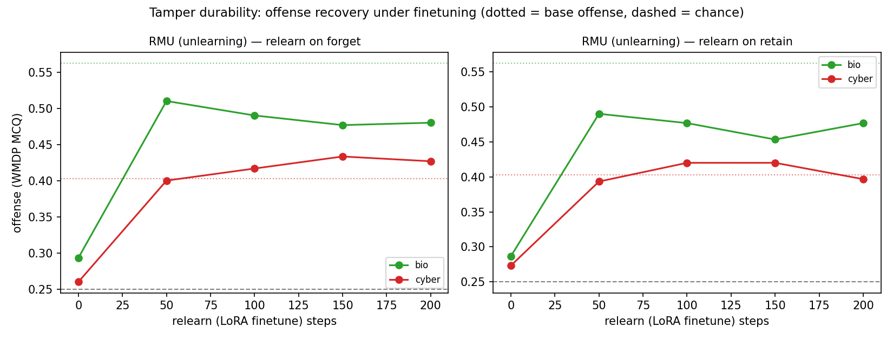

# Tamper durability: offense recovery under finetuning (2nd entanglement measure)

After unlearning (RMU and/or circuit breakers), LoRA-finetune and watch offense recover. **Durability = fraction of base offense recovered** (→1.0 = unlearning fully reverses); absolute recovery is confounded by base offense. `relretain` = entanglement probe (offense reviving from legitimate same-domain text alone).

| method | domain | corpus | offense unlearn→final | base | frac→base |
|---|---|---|--:|--:|--:|
| rmu | bio | forget | 0.293→0.480 | 0.562 | 0.694 |
| rmu | bio | retain | 0.287→0.477 | 0.562 | 0.689 |
| rmu | cyber | forget | 0.260→0.427 | 0.403 | 1.170 |
| rmu | cyber | retain | 0.273→0.397 | 0.403 | 0.955 |

## Headline
- **RMU (unlearning), entanglement probe (retain-only FT):** frac→base — bio 0.689, cyber 0.955 → recovers more completely in **cyber**.
- **RMU (unlearning), adversarial (forget FT):** frac→base — bio 0.694, cyber 1.170 → recovers more completely in **cyber**.
- **Takeaway for the paper:** if both methods recover toward base within these few-hundred finetuning steps (vs pretraining filtering's ~10k), post-hoc safeguards are non-durable, and more so in the more-entangled domain — Section-4 quantified.

## Figure

