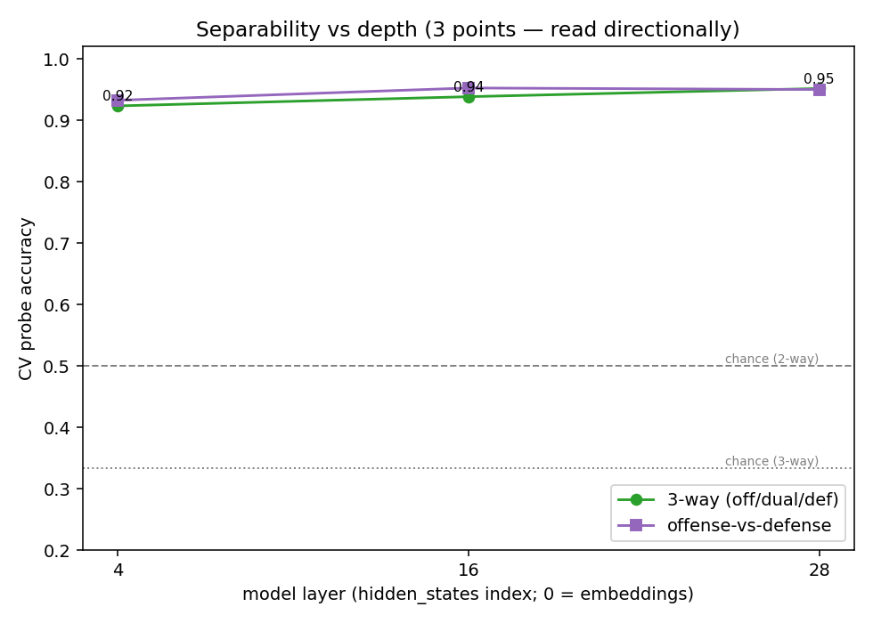
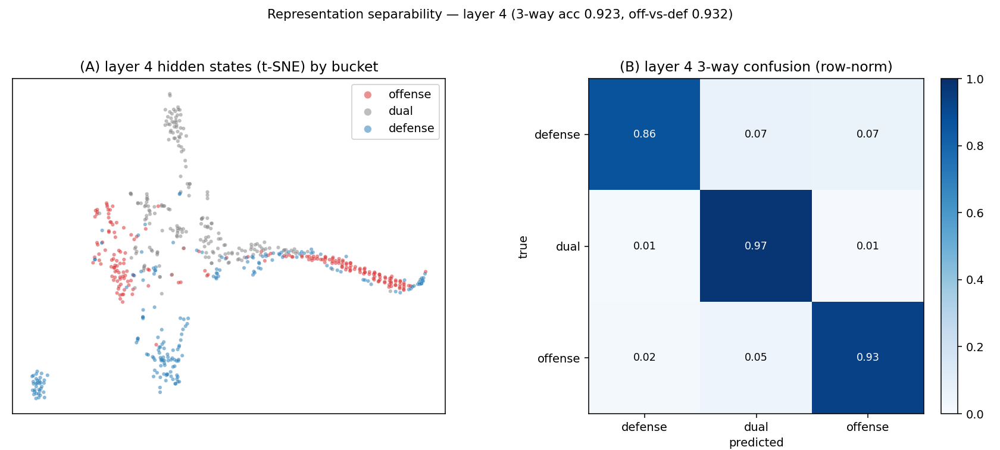
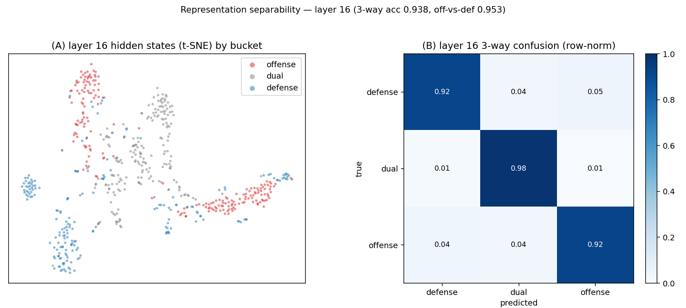
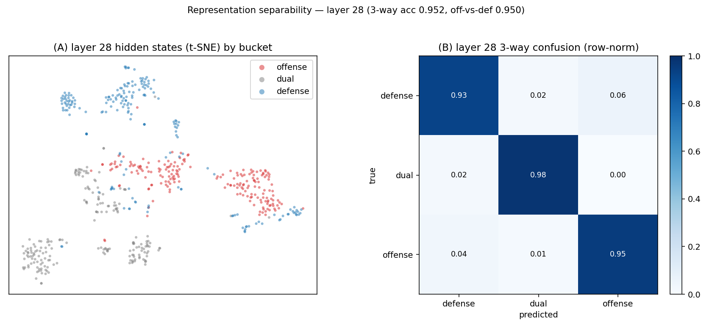

# Representation analysis — offense / dual / defense in Llama-3.1-8B hidden states

Mean-pooled hidden states for 200 docs/bucket (seed 0, masked-mean, bf16), layers [4, 16, 28]. Same probe/centroid/t-SNE instruments as the BGE pilot, so numbers are directly comparable. **Representation-separability** — closer to capability than the BGE *document*-separability, but still not the same thing; the unlearning-tax experiment is the definitive entanglement test.

## Headline numbers (per layer)

| layer | 3-way acc | off-vs-def acc | dual between? | dual closer to | borderline: off / dual / def |
|------:|----------:|---------------:|:-------------:|:--------------:|:----------------------------:|
| 4 | 0.923 | 0.932 | NO | defense | 0.11 / 0.04 / 0.17 |
| 16 | 0.938 | 0.953 | NO | defense | 0.08 / 0.03 / 0.10 |
| 28 | 0.952 | 0.950 | NO | defense | 0.05 / 0.02 / 0.07 |

## The four questions

**1. vs the BGE pilot (3-way 0.900 semantic / 0.934 lexical; off-vs-def 0.927/0.943).** Llama hidden states reach a peak 3-way accuracy of 0.952 (layers [4, 16, 28]); off-vs-def peaks at 0.953. That is comparable to or above the document-embedding pilot — the three-way structure is if anything *clearer* inside the model than in BGE space.

**2. Where does dual sit per layer?** **Dual is not between offense and defense — it clusters with defense.** At every layer the closest pair is defense-dual and the *widest* pair is offense-dual (wider than offense-defense itself), so **offense is the representational outlier** while dual and defense sit together. The defense-vs-dual gap stays smallest and the offense-vs-dual gap stays largest as depth increases — i.e. the model represents the neutral substrate more like defense content than like offense content, and that asymmetry sharpens with depth.

**3. Does separability rise with depth?** 3-way accuracy is **rising** across layers 4→28 (0.923→0.952); off-vs-def is **roughly flat** (0.932→0.950). Rising separability with depth is the signal we hoped for: the offense/dual/defense distinction sharpens in the deeper layers where unlearning interventions act, consistent with a capability-relevant (not merely surface/register) distinction. *Caveat:* only 3 layers were extracted, so this is **directional**, not a fine curve.

**4. Borderline (entangled-region) documents.** Fraction with out-of-fold P(true class) < 0.5 at the deepest layer (L28): offense 0.05, dual 0.02, defense 0.07. These low-confidence docs sit where the corpora overlap in representation space; they are exported per-doc in `data/document_confidence.parquet` as candidates for follow-up (the docs most likely to be co-affected by an offense-targeted unlearning intervention).

## What this suggests (and the caveat)

The headline shift from the BGE pilot: in the *model's* representation space the dual substrate does **not** sit in the middle — it clusters with **defense**, and **offense is the outlier** (offense-dual is the widest pair at every layer). Two readings, not mutually exclusive: (a) the defensive corpus (D3FEND prose) is itself heavily mechanism/substrate prose, so defense and substrate genuinely share representational structure — which is *what you'd expect if defense leans on the shared substrate*; (b) offensive content (attack procedures, threat-intel attribution) is stylistically/representationally distinctive, pulling it apart regardless of underlying capability. That separability **and** the defense↔dual closeness both **strengthen with depth**, which is the direction consistent with a capability-relevant distinction forming where unlearning acts.

**Caveat (load-bearing).** This is still the geometry of *pooled document vectors*, not capability entanglement in the weights. Document-space proximity of defense and dual does not prove that unlearning offense will (or won't) damage defense — that is precisely what the unlearning-tax experiment measures. What this analysis establishes is the *substrate the interventions operate on*: the buckets are cleanly linearly separable (≥0.92 three-way) deep in the network, so a representation-level forget/retain split is well-posed.

## Figures

## Per-layer spread-normalized centroid distances

| layer | offense-defense | offense-dual | defense-dual |
|------:|----------------:|-------------:|-------------:|
| 4 | 0.39 | 0.52 | 0.28 |
| 16 | 0.64 | 0.92 | 0.48 |
| 28 | 0.76 | 0.98 | 0.56 |
