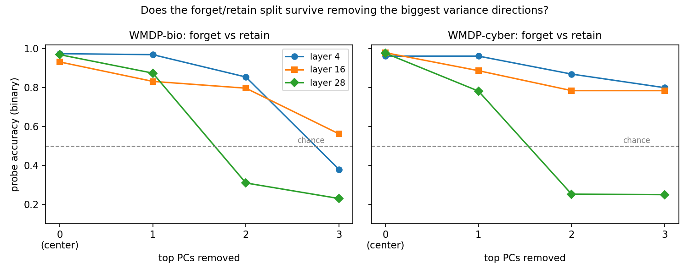
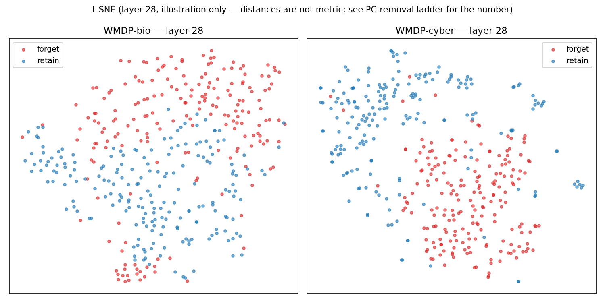

# WMDP bio vs cyber — cross-domain forget/retain entanglement geometry

**Scope.** Quantifies the bio<->cyber separability asymmetry WMDP App D asserts qualitatively. Binary forget/retain split per domain, identical protocol. **Separability is geometric evidence, not a causal entanglement claim** — the causal test is the unlearning tax + relearning speed (see `reports/pca_confound_check.md`).

**Data.** bio-forget `cais/wmdp-bio-forget-corpus` @ `5a786ed` (gated), bio-retain + cyber `cais/wmdp-corpora` @ `daf89fa` — sha256-pinned, see `scripts/prep_wmdp_units.py`. Bio source-docs capped at 3,000/split (seed 0) for shippability (cyber uncapped: 1,000 forget / 4,473 retain docs). Normalized with our unit pipeline (clean_text + resegment ~3k chars). Sampled per split (seed 0): bio {'forget': 200, 'retain': 200}, cyber {'retain': 200, 'forget': 200}.

**Protocol.** Llama-3.1-8B masked-mean pooled, layers 4/16/28, 5-fold stratified logistic probe (StandardScaler). Binary → chance 0.5. k=0 = mean-centering only; drop-top-k removes the top-k within-task principal directions. *Caveat (both domains equally):* the between-class direction usually sits among the top PCs, so within-task removal mechanically removes some class signal — identical treatment per domain.

## Head-to-head: within-task PC removal (acc / macro-F1, chance 0.5)

### WMDP-bio: forget vs retain
| layer | k=0 (center only) | drop top-1 | drop top-2 | drop top-3 |
|---:|:---:|:---:|:---:|:---:|
| 4 | 0.975 / 0.975 | 0.970 / 0.970 | 0.855 / 0.855 | 0.380 / 0.377 |
| 16 | 0.932 / 0.932 | 0.833 / 0.832 | 0.797 / 0.797 | 0.562 / 0.560 |
| 28 | 0.970 / 0.970 | 0.875 / 0.874 | 0.310 / 0.308 | 0.230 / 0.226 |

### WMDP-cyber: forget vs retain
| layer | k=0 (center only) | drop top-1 | drop top-2 | drop top-3 |
|---:|:---:|:---:|:---:|:---:|
| 4 | 0.963 / 0.962 | 0.963 / 0.962 | 0.870 / 0.870 | 0.800 / 0.800 |
| 16 | 0.980 / 0.980 | 0.887 / 0.887 | 0.785 / 0.784 | 0.785 / 0.784 |
| 28 | 0.978 / 0.977 | 0.783 / 0.781 | 0.253 / 0.251 | 0.250 / 0.249 |

## Forget/retain centroid cosine distance (raw space; coarse sanity check)
| layer | bio | cyber |
|---:|:---:|:---:|
| 4 | 0.022 | 0.026 |
| 16 | 0.031 | 0.064 |
| 28 | 0.039 | 0.059 |

## Interpretation (data-driven)
- **bio** L28: base 0.970 → drop-2 0.310 → drop-3 0.230; L4 drop-3 0.380, L16 drop-3 0.562.
- **cyber** L28: base 0.978 → drop-2 0.253 → drop-3 0.250; L4 drop-3 0.800, L16 drop-3 0.785.
- **Asymmetry (headline).** Mean drop-3 accuracy across layers: bio 0.391 vs cyber 0.612 (Δ = -0.221). Under confound-controlled PC removal, **cyber is more separable than bio** — the OPPOSITE direction to the WMDP App D intuition (which expects bio more separable).
- **The gap is shallow-layer-only.** At L28 — the layer RMU acts on — BOTH collapse to ~chance (bio 0.230, cyber 0.250); no asymmetry there. The cross-layer gap is driven entirely by the shallow/mid layers (drop-3: bio 0.471 vs cyber 0.792 at L4/L16), which `reports/pca_confound_check.md` flags as the confound-prone (topic/register/format) regime. Plausible confound: bio forget+retain are BOTH PubMed papers (same register, hard to separate), while cyber forget (offensive procedures) vs retain (CS-textbook prose) differ in register — a corpus-construction artifact, not knowledge entanglement.
- **Verdict.** Embedding geometry does not support the hypothesized bio>cyber separability asymmetry; at the RMU-relevant layer there is no asymmetry at all. This is the third geometric instrument to come back confound-bound (cf. `pca_confound_check.md`, `wmdp_cyber_geometry_baseline.md`). The capability-entanglement question must be answered by the causal unlearning-tax + relearning experiment, not by representation geometry.

## Figures

