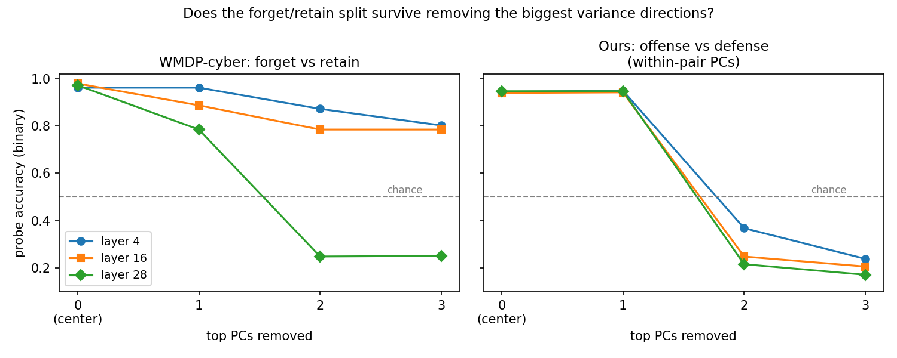
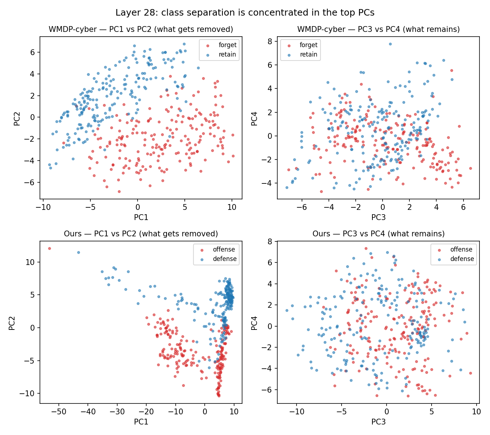

# WMDP-cyber geometry baseline — binary forget/retain separability under PC removal

**Scope.** Method calibration + possible benchmark critique. Binary forget/retain split; does NOT test the three-way substrate-entanglement hypothesis (WMDP has no substrate bucket). Separability ≠ entanglement.

**Data.** `cais/wmdp-corpora` @ `daf89fa9b618b63a624228061a9cebacca88009c` (2024-04-25): cyber-forget 1,000 docs / cyber-retain 4,473 docs (sha256-pinned, see `scripts/prep_wmdp_units.py`). Normalized with our exact unit pipeline (clean_text + resegment ~3k chars) → forget 3,917 / retain 14,738 units; sampled {'forget': 200, 'retain': 200} per split (seed 0). Comparison: hazardous-cyber forget text vs retain text.

**Protocol.** Identical to `reports/pca_confound_check.md`: Llama-3.1-8B masked-mean pooled, layers 4/16/28, 5-fold stratified logistic probe. **Binary → chance = 0.5** (the original check was 3-way, chance 0.333). k=0 is the mean-centering-only condition. *Protocol caveat (applies to both columns equally):* in a 2-class matrix the between-class direction is typically among the top PCs, so within-task PC removal partially removes class signal mechanically; the head-to-head is still apples-to-apples, and our corpus is also shown under global-PC removal for context.

## Head-to-head: within-task PC removal (acc / macro-F1, chance 0.5)

### WMDP-cyber: forget vs retain
| layer | k=0 (center only) | drop top-1 | drop top-2 | drop top-3 |
|---:|:---:|:---:|:---:|:---:|
| 4 | 0.963 / 0.962 | 0.963 / 0.962 | 0.872 / 0.872 | 0.802 / 0.802 |
| 16 | 0.980 / 0.980 | 0.887 / 0.887 | 0.785 / 0.784 | 0.785 / 0.784 |
| 28 | 0.972 / 0.972 | 0.785 / 0.784 | 0.247 / 0.246 | 0.250 / 0.249 |

### Our corpus: offense vs defense (same within-pair protocol)
| layer | k=0 (center only) | drop top-1 | drop top-2 | drop top-3 |
|---:|:---:|:---:|:---:|:---:|
| 4 | 0.945 / 0.945 | 0.950 / 0.950 | 0.367 / 0.365 | 0.237 / 0.233 |
| 16 | 0.940 / 0.940 | 0.942 / 0.942 | 0.248 / 0.246 | 0.205 / 0.205 |
| 28 | 0.948 / 0.947 | 0.948 / 0.947 | 0.215 / 0.214 | 0.170 / 0.169 |

### Context — our offense-vs-defense under GLOBAL PCs (from the 600-doc 3-way matrix)
| layer | k=0 (center only) | drop top-1 | drop top-2 | drop top-3 |
|---:|:---:|:---:|:---:|:---:|
| 4 | 0.945 / 0.945 | 0.943 / 0.942 | 0.950 / 0.950 | 0.608 / 0.601 |
| 16 | 0.940 / 0.940 | 0.938 / 0.937 | 0.853 / 0.851 | 0.417 / 0.414 |
| 28 | 0.948 / 0.947 | 0.948 / 0.947 | 0.948 / 0.947 | 0.940 / 0.940 |

Reference, our 3-way probe (chance 0.333): L28 base 0.950 → drop-3 **0.808** (robust); L4/L16 collapse to ≤ chance by drop-3 (`reports/pca_confound_check.md`).

## Interpretation (sober)
- WMDP L28: base 0.972 → drop-2 0.247 → drop-3 0.250. Ours L28 (same protocol): 0.948 → 0.215 → 0.170.
- WMDP-cyber forget/retain separability **collapses** under within-task PC removal, matching our corpus: in both, the binary split is concentrated in a few dominant variance directions (consistent with register/topic confounds, with the mechanical-removal caveat above applying to both).
- **Layer contrast.** Drop-3 survival (acc > 0.65) — WMDP: layers [4, 16] (L4 0.802, L16 0.785, L28 0.250); ours: layers none (L4 0.237, L16 0.205, L28 0.170). The two splits do NOT share one profile: where they survive/collapse differs by depth, so any single-verdict reading is an oversimplification.
- Either way this is separability calibration only: no entanglement claim, and no substrate-domain analysis was run on WMDP (no substrate labels; that analysis already produced a confound artifact on our data).

## Figures

